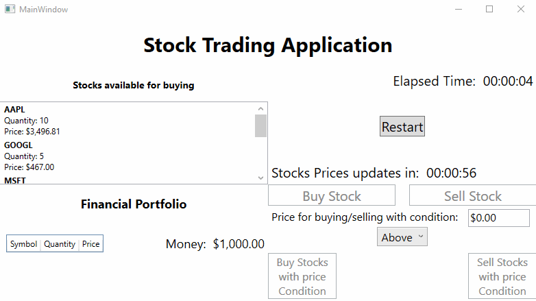

# StockTradingApplication

## Overview

**StockTradingApplication** is a fully-featured stock trading platform built using C# and WPF, leveraging the **MVVM (Model-View-ViewModel)** pattern to ensure separation of concerns and maintainability. It allows users to buy and sell stocks, manage their financial portfolio, and track real-time stock price updates. 

The solution also includes a comprehensive unit testing project to ensure the robustness and reliability of the application’s core functionalities.

## Demo Showcase


## Table of Contents

- [Overview](#overview)
- [Demo Showcase](#demo-showcase)
- [Installation](#installation)
  - [Prerequisites](#prerequisites)
  - [Steps](#steps)
- [Usage](#usage)
  - [Notes on Usage](#notes-on-usage)
- [Features](#features)
- [Architecture](#architecture)
  - [MVVM Pattern](#mvvm-pattern)
  - [Key Components](#key-components)
  - [Design and Code Improvements](#design-and-code-improvements)
- [Flow and Structure](#flow-and-structure)
  - [Application Flow](#application-flow)
  - [Commands and Controls](#commands-and-controls)
  - [Logging](#logging)
- [Tests](#tests)
- [Ideas for improvements in the future](#ideas-for-improvements-in-the-future)
- [Changelog](#changelog)
- [Contributing](#contributing)
- [License](#license)

## Installation

### Prerequisites

- Visual Studio Code, or any other text editor or IDE with C# compiler
- .NET 8.0 SDK
- Windows operating system

### Steps

1. Clone the repository:
    ```bash
    git clone https://github.com/raken15/StockTradingApplication.git
    ```
    1. Another option is to click on the green "<> code" button in the the project Github page, download as zip, unzip it

2. Navigate to the solution directory:
    ```bash
    cd StockTradingApplication
    ```
    1. Or go to the solution folder using the file explorer

3. Open the solution(.sln file) in Visual Studio Code, or another text editor or IDE, with C# compiler

4. Build the solution to restore all dependencies.

## Usage

1. Build the solution.
2. Run the application using Visual Studio Code or from the executable(.exe file) in the bin folder.
3. Use the UI to manage stock trading activities. Prices update automatically, and you can monitor your financial portfolio's performance.
4. The goal is to reach Winning money value($10000 by default), while avoiding going under losing money value($1 by default)
  
### Notes on Usage
1. The executable should be located in this path after the build: [path-to-directory-containing-the-solution]\StockTradingApplication\bin\Debug\net8.0-windows\
2. Before running, initial settings like starting money($1000 by default) and others can updated using the InitialSettings.txt file
  1. The InitialSettings.txt file should be located in [path-to-directory-containing-the-solution]\StockTradingApplication\bin\Debug\net8.0-windows\Assets after the build
  2. The settings must follow the specific format like in the following example: "Key string" : "Value as string" , any other format will result in error.

## Features

- **Real-Time Stock Price Updates**: Provides simulated real-time updates with periodic randomization for a more dynamic experience.
- **Stock Trading Functionality**: Enables the buying and selling of stocks based on specific price and quantity criteria.
- **Portfolio Management System**: Offers tools to monitor assets, track portfolio value, and evaluate overall performance.
- **MVVM Architecture**: Implements the Model-View-ViewModel (MVVM) design pattern to enhance maintainability and testability of the application.
- **Comprehensive Unit Testing**: Ensures the reliability of core functionalities through robust unit tests.
- **Command Pattern Implementation with RelayCommand**: Facilitates efficient communication between ViewModels and the user interface through custom command bindings.
- **Logging with SimpleLogger**: Tracks application events and methods to assist in debugging and monitoring user interactions.
- **Configurable Initial Settings**: Allows users to customize initial parameters (such as starting money) via an `InitialSettings.txt` file.
- **Stock Data Repository**: Provides a centralized repository for accessing stock-related data and retrieving initial application data.
- **Game Restart Functionality**: Allows users to restart the game at any time to refresh their experience.
- **Game Outcome Notifications**: Displays an overlay when specific thresholds are reached, indicating either a win or loss in the game.
- **Price-Conditioned Stock Trading**: Enables users to buy or sell stocks based on specified price conditions (above/equal/below).

## Architecture

The application follows the **MVVM architecture**. This design pattern enforces a clear separation of concerns, promoting a structured and maintainable codebase. 

### MVVM Pattern

- **Model**: Encapsulates business logic and data representation. Examples include `StockModel` and `FinancialPortfolioModel`.
- **View**: Defines the UI using XAML. For instance, `MainWindow.xaml` is responsible for displaying the main user interface.
- **ViewModel**: Acts as a bridge between the Model and View. ViewModels like `MainViewModel` and `StockViewModel` expose data and commands to the View and handle user interaction logic.

### Key Components

- **MainViewModel**: The primary ViewModel managing the stock data, user operations, and overall application state.
- **StockModelRepository**: Manages stock-related data, encapsulating data access logic and business operations.
- **FinancialPortfolioViewModel**: Manages the user's portfolio, handling stock buy/sell operations and updating the UI accordingly.
- **RelayCommand**: Implements command logic, binding actions (such as button clicks) to methods in the ViewModel.
- **SimpleLogger**: Provides logging functionality to record important events, errors, and messages during the application's runtime.
- **InitialSettings**: Provides the initial settings for the run, for example: Time between price updates or starting money.

### Design and Code Improvements

- **MVVM structure**: Promotes loose coupling between UI (View) and business logic (ViewModel), making the code easier to test and maintain.
- **Command pattern**: Utilizes `RelayCommand`, providing flexibility in executing UI commands and supporting validation (e.g., `CanExecute`).
- **Price update simulation**: The stock prices are updated in real-time with a timer-based event handler for simulating stock market fluctuations.
- **Logging with `SimpleLogger`**: Centralized logging captures important events (e.g., stock price updates, successful trades) and errors for debugging and monitoring.
- **Dependency Injection (DI)**: Ensures that ViewModels and services are easily testable and interchangeable, facilitating future modifications.
- **OOP Principles**: implements OOP principles by using
  -Encapsulation (e.g., properties and methods managing internal states like in StockViewModel)
  -Abstraction (e.g., IRepository interface abstracts data access)
  -Inheritance (e.g., ViewModelBase for shared logic in ViewModels)
  -Polymorphism (e.g., commands and event handlers using polymorphic behavior for user interactions).
- **SOLID Principles**: project implements the SOLID principles by ensuring:
  -Single Responsibility: Each class (e.g., StockViewModel, FinancialPortfolioViewModel) handles a single responsibility.
  -Open/Closed: Classes like StockModelRepository are open for extension but closed for modification via interfaces (IRepository).
  -Liskov Substitution: ViewModels and Models can be replaced by their base types without affecting the functionality.
  -Interface Segregation: The repository interfaces (IRepository) only expose necessary methods, keeping them focused.
  -Dependency Inversion: Dependency injection is used to decouple high-level modules from low-level modules, making the code more testable and flexible.
- **CRUD** principle: project implements the CRUD principle by:
  - Creating, Reading, Updating, and Deleting stock and portfolio data
    -where users can create and update trades (buy/sell), read stock prices and portfolio information, and remove stocks from the portfolio when sold.
- **Testing**: unit testing is implemented using xunit
- **Initial settings**: initial settings can be changed by user, using a text file that is read by the code

## Flow and Structure

```text
StockTradingApplication/
├── Assets/
│   └── InitialSettings.txt            # Initial configuration settings for stock prices, limits, etc.
├── Helpers/
│   ├── RelayCommand.cs                # Command class for handling user actions.
│   ├── SimpleLogger.cs                # Custom logger for tracking events and errors.
├── Models/
│   ├── FinancialPortfolioModel.cs     # Represents user’s portfolio data (e.g., stocks owned, value).
│   └── StockModel.cs                  # Represents stock details (symbol, price, quantity).
├── Repositories/
│   ├── IRepository.cs                 # Generic repository interface for data access.
│   └── StockModelRepository.cs        # Implements stock data retrieval and storage.
├── ViewModels/
│   ├── FinancialPortfolioViewModel.cs # Handles portfolio-related logic and updates.
│   ├── MainViewModel.cs               # Core ViewModel, binding UI to stock and portfolio data.
│   └── StockViewModel.cs              # Handles logic for individual stock items.
├── Views/
│   ├── MainWindow.xaml                # UI definition for the main window.
└── App.xaml                           # General application configuration for the project
    └── App.xaml.cs                    # Application entry point. which calls and start the main window.
Tests/
    └── MainWindowViewModelTests.cs    # Unit tests for validating MainViewModel behavior.
```
### Application Flow

- **Initialization**: The app reads `InitialSettings.txt` for stock limits and portfolio values.
  - Initial Stock values are provided by the `StockModelRepository.cs` default value, and are changed to be with random prices at the start of the run.
  - Timers are also initialized.
- **Real-time Updates**: Stock prices are periodically updated by the `MainViewModel`, which triggers UI updates.
- **User Interaction**: The user can buy or sell stocks, with conditions applied to the price and quantity.
- **Data and display Management**:
  - **Portfolio Management**: The portfolio is updated based on successful trades, and the `FinancialPortfolioViewModel` handles this data binding.
  - **Stocks Management**: Stocks for sale list is updated based on successful trades, and the `StockViewModel` handles this data binding
- **Victory/Loss Conditions**: The game logic is based on financial thresholds defined in the settings.

### Commands and Controls

- **Buy Stocks**: Purchase available stocks from the market.
- **Sell Stocks**: Sell owned stocks, updating the portfolio.
- **Real-time Updates**: Observe live changes in stock prices.
- **Win/Loss Conditions**: The game shows an overlay when specific thresholds are reached, either winning or losing the game.
- **Buy/Sell Stocks with price condition**: Buy/Sell all stocks that are above/equal/below a specified price.
- **Restart**: Option to restart the game.

### Logging

The application uses a custom logging mechanism (`SimpleLogger.cs`) to track important events:

- Logs stock price updates, buy/sell operations, and exceptions.
- Stores logs in a file for later debugging or real-time monitoring.

The logs will appear in [path-to-project]\bin\Debug\net8.0-windows after building and running the project.

## Tests

The `Tests` folder contains unit tests to ensure the functionality of the ViewModels:

- **MainViewModelTests**:
  - Verifies the core logic for managing stock data and user interaction.
  - Ensures the portfolio and the stocks updates correctly after trades.
  - Checks that the win/loss conditions are triggering correctly
  - Make sure that the update to the stock prices with periodic randomization happens correctly

### To run tests:

1. Navigate to the Tests directory:
    ```bash
    cd [path-to-solution]\Tests
    ```
    1. Alternatively navigate to the Tests folder using the file explorer [path-to-solution]\Tests

2. Run the tests using the .NET CLI:
    ```bash
    dotnet test
    ```
    1. Alternatively open the project in Visual Studio Code or any matching IDE and run the tests from the run tests button in there

3. Review the results to ensure all tests pass.

## Ideas for improvements in the future
1. Make the logging implement the ILogger interface and allow users to define where their logs will be saved using logging configuration file
2. Add random message for events that are affecting specific stocks and make those stocks prices be affected accordingly, to give the users more authentic feel to the trading.
   1. For example: message shown is "MSFT has launched a new product" , and then in the next price update MSFT stock price will increase.
3. Make the users have the ability to add new stocks or remove stocks from the available stocks.
4. Make the Stock repository default values be from a text or xml file, so that it could be updated or changed by the user before starting the application.
   1. Later it should be even further improved to use a Database instead for the source
6. Add more functionalities regarding stocks like lower number of stocks affect price or higher number of stocks affecting price
7. Make the Application for multiple users at the same time, like one user trading is affecting another, and they both see the same values and same stocks in real-time

## Changelog
For a detailed list of changes, please see the [CHANGELOG.md](CHANGELOG.md).

## Contributing

In order To contribute:

1. Fork the repository.

2. Create a new branch with your feature/fix:
    ```bash
    git checkout -b features\feature-name
    ```

3. Commit your changes and open a pull request. Ensure all changes are tested before submitting a PR.
4. Resolve any merge conflicts
5. Wait for approval on the PR
6. Fix and respond to any comments in the PR
7. Once the PR is approved complete the merge and move to the main branch and pull the latest to see your action

## License

This project is licensed under the MIT License. See the [LICENSE](LICENSE) for details.
